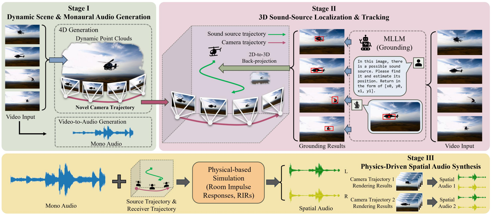

# Sonic4D: Spatial Audio Generation for Immersive 4D Scene Exploration

**Authors:** Siyi Xie, Hanxin Zhu, Tianyu He, Xin Li, Zhibo Chen  

## TL;DR

**Sonic4D** is a novel training-free framework that enables **spatial audio generation** for immersive exploration of **4D scenes**. It provides plausible spatial audio that varies across different **viewpoints** and **timestamps**.

## Pipeline

## Video Demos

🎧 Please wear headphones and turn up the volume to enjoy the examples. 🎧

A helicopter hovering in the air.

https://github.com/user-attachments/assets/f5824827-9bee-4161-9b71-4de5a2d809b1

Drummer playing African drums.

https://github.com/user-attachments/assets/6aa73d4d-2ad9-48c7-9247-872561550cef

The volcano is erupting.

https://github.com/user-attachments/assets/5219be41-952c-4780-a898-893a9432ce35

More examples can be found at [project page](https://X-Drunker.github.io/Sonic4D-project-page)
## Related Projects

- [GroundingGPT](https://github.com/lzw-lzw/GroundingGPT)
- [TrajectoryCrafter](https://github.com/TrajectoryCrafter/TrajectoryCrafter)
- [MMAudio](https://github.com/hkchengrex/MMAudio)

## BibTeX
BibTex Code Here

## Acknowledgments
Parts of this project page were adopted from the [Nerfies](https://nerfies.github.io/) page.

## Website License
 This work is licensed under a <a rel="license" href="http://creativecommons.org/licenses/by-sa/4.0/">Creative Commons Attribution-ShareAlike 4.0 International License</a>.
